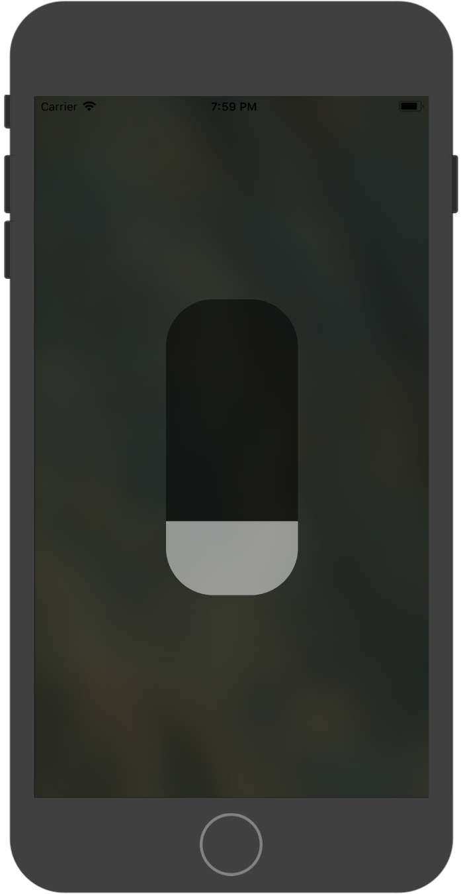

# MJSlider
A flat vertical slider for iOS/Swift 4
<html
img {
width: 50%;
}

</html>

##Can set/get:

- backgroundColor (UIColor), the color of the background
- tintColor (UIColor), the color of the slider
- cornerRadius (Float), the amount of roundness
- transparency (Float), the amount of opacity (0-1)
- value (Float), the slider value (0-1)

